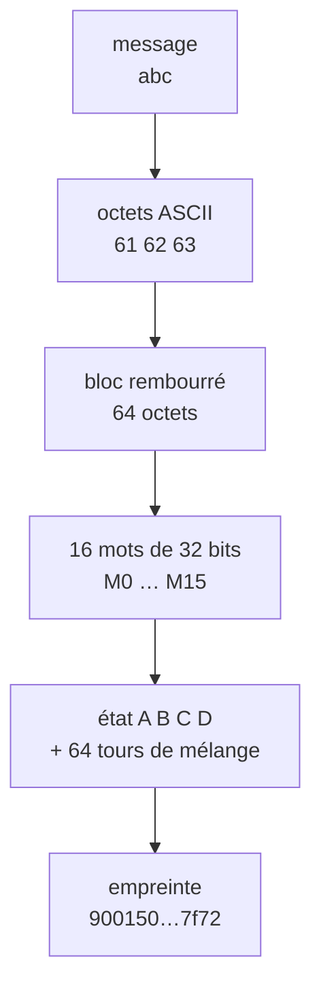
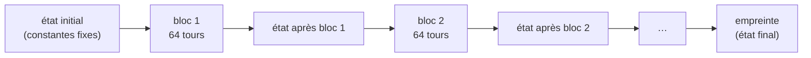

# ft_ssl — comment marche MD5

MD5 est une **machine à empreintes** : tu lui donnes n'importe quelle suite d'octets, elle recrache toujours une empreinte de **16 octets** (32 caractères hexadécimaux). Même entrée → même empreinte ; une seule lettre qui change → empreinte totalement différente ; et on ne peut jamais revenir en arrière (fonction à sens unique).

Ce README explique le fonctionnement en deux temps : d'abord un **message court** (un seul bloc), puis un **message long** (plusieurs blocs).

---

## Les unités (à lire une fois, ça débloque tout)

Il n'y a **qu'une seule donnée** — une suite d'octets — regroupée de plusieurs façons :

| Unité | Taille | Rôle | Type C |
|-------|--------|------|--------|
| octet | 8 bits | l'unité du message | `uint8_t` |
| mot | 32 bits = 4 octets | l'unité de **calcul** | `uint32_t` |
| bloc | 512 bits = 64 octets = 16 mots | l'unité de **traitement** | — |
| état / digest | 128 bits = 16 octets = 4 mots | la **sortie** | `uint32_t st[4]` |
| champ longueur | 64 bits = 8 octets | un nombre collé au padding | `uint64_t` |

---

## Cas 1 — message court (un seul bloc)

Exemple : `"abc"` → empreinte `900150983cd24fb0d6963f7d28e17f72`.



### Les étapes en détail

**1. Le message devient des octets.** `"abc"` → `61 62 63` (codes ASCII en hexa).

**2. Le rembourrage (padding).** MD5 ne travaille que sur des blocs de 64 octets pleins. On complète donc le message :

```
[ message ][ 80 ][ 00 00 00 … 00 ][ longueur en bits, 8 octets, little-endian ]
|<------------------------- 64 octets = un bloc ------------------------->|
```

- on pose un octet `80` juste après le message,
- on remplit de zéros,
- les **8 derniers octets** contiennent la longueur du message **en bits**, écrite en little-endian.

**3. On regroupe en 16 mots.** Le bloc de 64 octets devient 16 mots de 32 bits. Chaque mot lit ses 4 octets **à l'envers** (little-endian) — c'est le point d'endianness propre à MD5.

**4. Les 64 tours.** On part d'un état fixe de 4 mots (`A B C D`, toujours les mêmes constantes). Les 64 opérations « touillent » cet état de façon irréversible ; c'est là qu'entrent tes données (`M[g]`).

**5. La sortie.** Après le dernier tour, on additionne l'état de départ à l'état touillé, puis on réécrit les 4 mots en little-endian et on les colle : c'est l'empreinte.

> Les étapes **1 et 2 seulement** dépendent de ton message. À partir de l'étape 3, la mécanique est identique pour n'importe quelle entrée.

---

## Cas 2 — message long (plusieurs blocs)

Un bloc ne fait que 64 octets. Dès que le message est trop grand, il faut **plusieurs blocs**, traités **l'un après l'autre**.

### La règle des 55 octets

Le padding a besoin d'au moins **9 octets libres** à la fin (1 pour le `80` + 8 pour la longueur). Donc :

```
nombre de blocs = arrondi_supérieur( (N + 9) / 64 )
```

- message ≤ **55 octets** → 1 bloc
- message de 56 à 119 octets → 2 blocs
- etc.

### Le chaînage — l'idée centrale

On ne **repart pas de zéro** à chaque bloc. L'état de sortie d'un bloc devient l'état d'**entrée** du bloc suivant. Seul le **premier** bloc démarre sur les constantes fixes ; l'empreinte est l'état après le **dernier** bloc.



Chaque bloc « emporte » le résultat de tous les précédents. C'est pour ça qu'un seul octet modifié au début change toute l'empreinte.

### Découpe d'un message de 2 blocs

```
Bloc 1 : [ ================ 64 octets de message ================ ]
Bloc 2 : [ reste du message ][ 80 ][ zéros ][ longueur 8 octets ]
```

### ⚠️ Le cas piège : 56 à 63 octets

Si le message fait entre 56 et 63 octets, le `80` tient encore dans le bloc 1… **mais plus la longueur**. Résultat : un **bloc 2 entier** qui ne contient que du rembourrage (zéros + longueur). C'est le cas où beaucoup d'implémentations se plantent — à **tester explicitement**.

---


Le fait que `st` soit **modifié sur place** dans la boucle, sans reset entre les blocs, **c'est le chaînage**. Les messages longs sont donc gérés « gratuitement » par la boucle, à condition que `md5_pad` calcule la bonne taille totale (`padded`) couvrant tous les blocs.

| Concept | Fonction |
|---------|----------|
| octets → padding → longueur | `md5_pad` |
| 16 mots + 64 tours sur `A B C D` | `md5_block` |
| init de l'état + boucle + sortie | `ft_md5` |

---

## Tester

MD5 travaille sur des **octets bruts**, donc toujours comparer avec les mêmes octets (pas de `\n` parasite d'`echo`) :

```bash
printf '%s' "abc" | md5sum      # référence
./test_md5 "abc"                # ta version
```

Cas à couvrir absolument : chaîne vide, et des longueurs de **55, 56, 63, 64 et 65 octets** (les frontières de bloc), plus un fichier binaire avec des `\0` au milieu.
